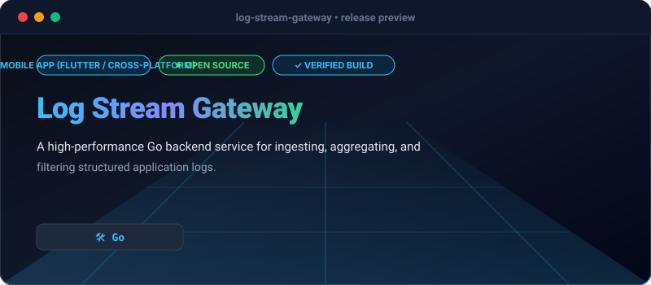

# Log Stream Gateway

[](https://github.com/Olamideakinade/log-stream-gateway)
[](https://opensource.org/licenses/MIT)



A high-performance Go backend service for ingesting, aggregating, and filtering structured application logs.

## Key Capabilities

- **In-Memory Ring Buffer**: Thread-safe circular buffer prevents out-of-memory errors by retaining a fixed maximum number of logs.
- **Structured JSON Ingestion**: Validates and indexes incoming JSON log entries with metadata support.
- **Zero External Dependencies**: Built entirely using the Go standard library for minimal footprint and maximum maintainability.

## Quickstart

Run the server locally:

```bash
go run main.go --port 8080 --capacity 500
```

Ingest a log entry:

```bash
curl -X POST http://localhost:8080/logs \
  -H "Content-Type: application/json" \
  -d '{"level":"INFO","service":"auth-api","message":"user authenticated"}'
```

Fetch ingested logs:

```bash
curl http://localhost:8080/logs
```

Run tests:

```bash
go test -v ./...
```

## Architecture & Design

The gateway exposes a lightweight HTTP listener coupled to a thread-safe ring buffer. Mutex locks protect concurrent reads and writes from multiple HTTP handler routines, ensuring thread safety without heavy database overhead.

## License

MIT
